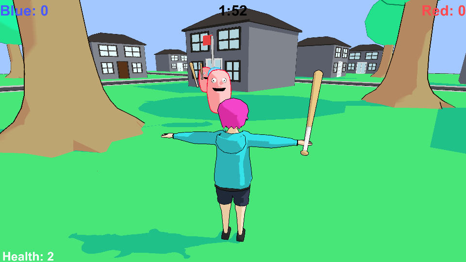

# Capture the Flag AI

Capture the Flag is a project I've been working on in 2018. I'm using it to practice modeling and to test AI behavior. I've made all of the Assets so far and have written all of the code myself. The original purpose was to balance making it a complete game with testing new features, but now the purpose is to develop a Neural Network capable of playing capture the flag.

The build from before the game's focus became Neural Networks can be found below. A new build will be uploaded when the neural network is stable enough to allow weight importing and exporting.

The current version contains a fully implemented Neural Network for determining the CPU player actions. As of right now, the weights for the network cannot be imported or exported, rather, the CPU players always start with random weights and are trained whenever the human player takes part in a game. The current version does not perform very well, as there is a lot of bad training data coming from the player and I haven't finalized the network structure, so it takes lots of consecutive playthroughs to get the CPU's to even leave their own goal.

The neural network currently has 8 inputs, 5 outputs, 4 hidden layers and 4 nodes per layer. Each layer uses TanH as the activation function. After fixing the issues with the training sets generated by the player, I will reevaluate the effectiveness of this structure. the inputs and outputs are as follows:

Inputs:

Estimated flag offset (angle and distance)

Home goal offset (angle and distance)

Closest enemy offset (angle and distance within range of sight)

Enemy has flag (0 or 1)

Carrying flag (0 or 1)

Outputs:

Horizontal move (-1 to 1)

Vertical move (-1 to 1)

Move magnitude (0 to 1)

Jump (0 or 1)

Attack (0 or 1)

#### Old Build:

[Capture the Flag 0.0.8](CurrentBuild/CTF_008.zip)

#### Controls:

WASD to Move

Space to Jump

Mouse controls the Camera

Click or CTRL to Attack

Q or E to Drop the Flag

M to Toggle the Mouse

ESC to Quit the Game
